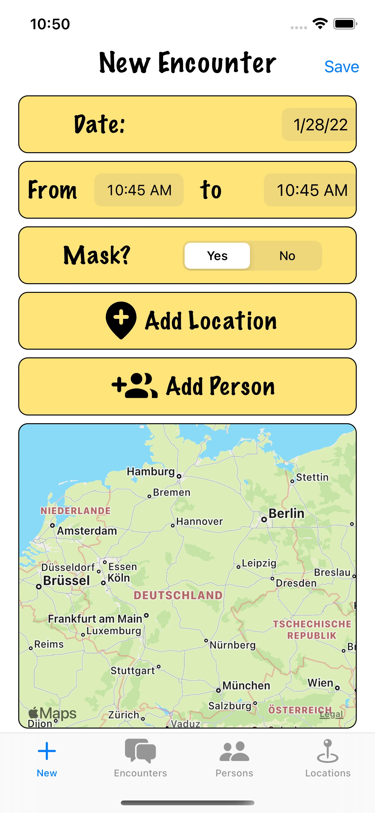
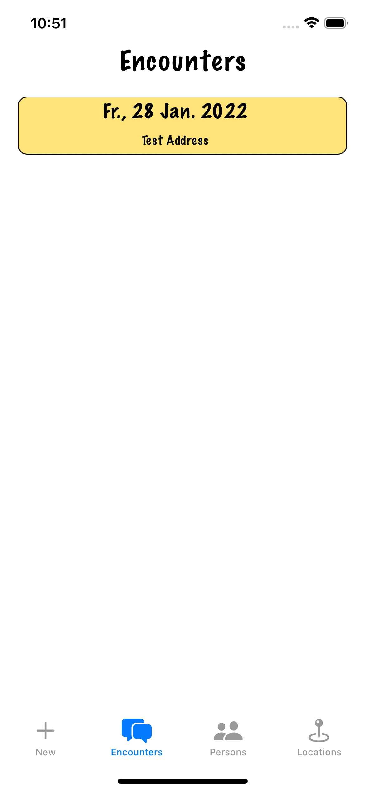
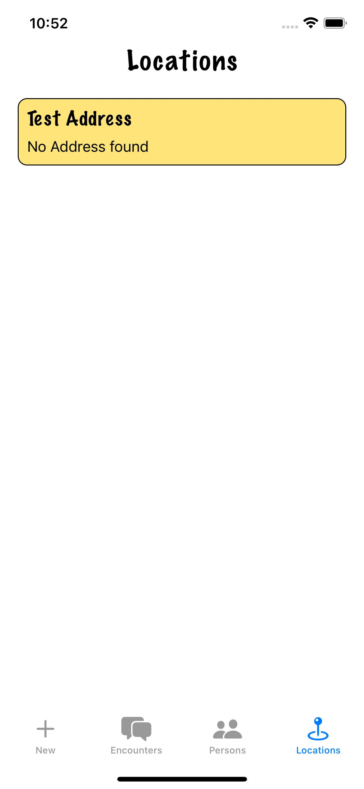
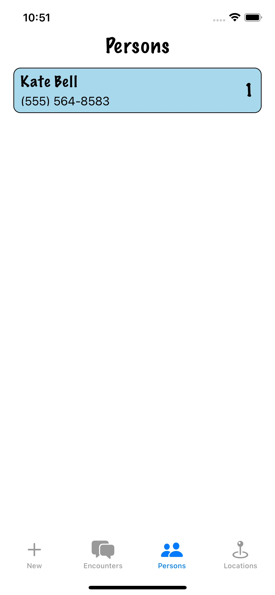

[English](README.md) · [Deutsch](README.de.md)

# Contact Log

An iOS application for tracking and logging personal and professional contact interactions. Built natively with Swift and SwiftUI, the app uses Core Data for local persistence with CloudKit sync for seamless data continuity across devices.

## Screenshots

### Features

- **Interaction Logging**: Record meetings, calls, emails, and other interactions with contacts, each with date, duration, notes, and outcome tags.
- **Contact Timeline**: A chronological view of all interactions with a given contact, making it easy to recall conversation history before an important meeting.
- **Smart Reminders**: Set follow-up reminders per contact or interaction type, surfaced as local notifications.
- **iCloud Sync**: Core Data's NSPersistentCloudKitContainer syncs all data seamlessly across the user's devices via CloudKit.
- **SwiftUI Throughout**: The entire UI is built with SwiftUI, using the MVVM pattern with `@StateObject`, `@ObservedObject`, and `@FetchRequest` property wrappers.

### Technical Highlights

The CloudKit integration was the most technically interesting aspect — setting up the CloudKit schema, handling merge conflicts in the sync layer, and managing private vs. public databases. Core Data's integration with SwiftUI through `@FetchRequest` and `NSManagedObjectContext` provides a clean, reactive data layer.
