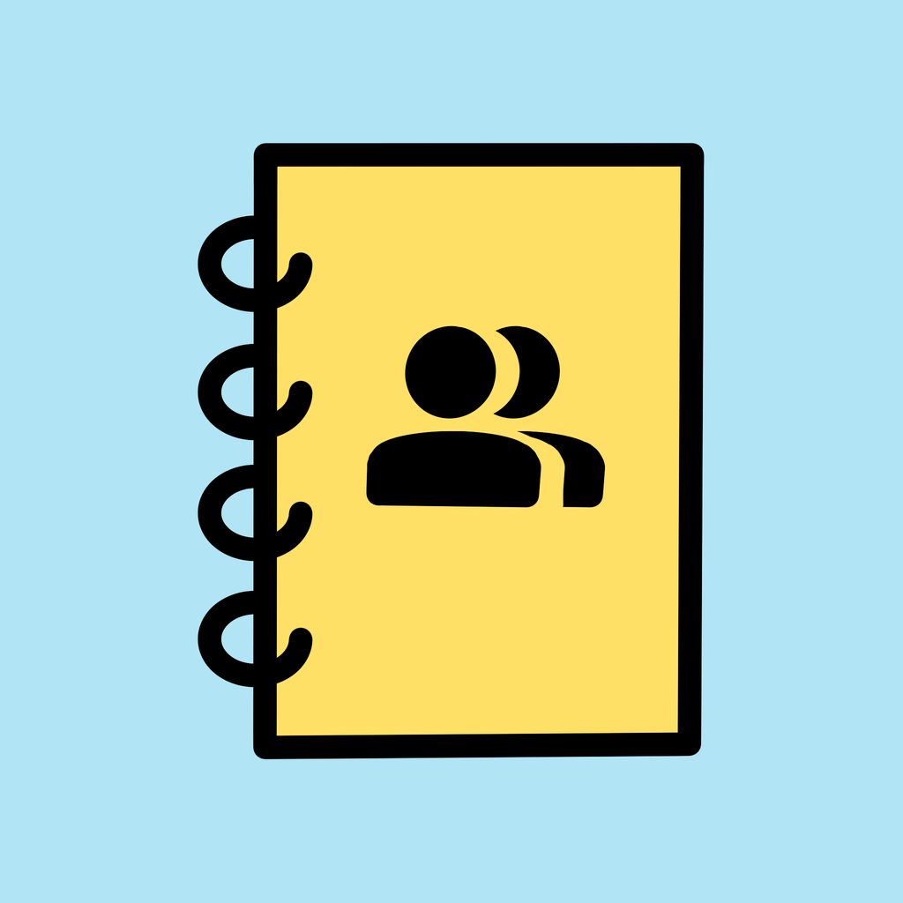

<!-- Improved compatibility of back to top link: See: https://github.com/othneildrew/Best-README-Template/pull/73 -->
<a id="readme-top"></a>

<!-- PROJECT LOGO -->
<br />
<div align="center">
  <a href="https://github.com/othneildrew/Best-README-Template">
    
  </a>

  <h3 align="center">Corona-Kontakttagebuch</h3>

  <p align="center">
    A contact diary to log encounters with people and visits to locations.
    <br />
    This project was part of the 119310 Mobile Web Application Course of the Media University Stuttgart.
  </p>
</div>


<!-- TABLE OF CONTENTS -->
<details>
  <summary>Table of Contents</summary>
  <ol>
    <li>
      <a href="#about-the-project">About The Project</a>
      <ul>
        <li><a href="#built-with">Built With</a></li>
      </ul>
    </li>
    <li>
      <a href="#getting-started">Getting Started</a>
      <ul>
        <li><a href="#setup">Set Up</a></li>
      </ul>
    </li>
    <li><a href="#description">Description</a></li>
    <li><a href="#structure">Structure</a></li>
    <li><a href="#logic">Logic</a></li>
    <li><a href="#design">Design</a></li>
    <li><a href="#team-members">Team Members</a></li>
    <li><a href="#license">License</a></li>
  </ol>
</details>


<!-- ABOUT THE PROJECT -->
## About The Project

With our Contact Diary, it's possible to save the locations you have been to and the people you have met for the last 14 days. After this period, the data is automatically deleted to ensure privacy and relevance.

Here's why this app is useful:
*   It helps you keep a private log of your contacts and places you've visited.
*   In case of a health notice, you can easily retrace your steps and inform relevant contacts.
*   The app is designed to be quick and simple, focusing on the essential task of logging encounters.

<p align="right">(<a href="#readme-top">back to top</a>)</p>


### Built With

*   [Swift](https://developer.apple.com/swift/)
*   [UIKit](https://developer.apple.com/documentation/uikit/)
*   [Core Data](https://developer.apple.com/documentation/coredata/)
*   [MapKit](https://developer.apple.com/documentation/mapkit/)
*   [Google Places API](https://developers.google.com/places/web-service/search)
*   [Google Geocoding API](https://developers.google.com/maps/documentation/geocoding/start)

<p align="right">(<a href="#readme-top">back to top</a>)</p>


<!-- GETTING STARTED -->
## Getting Started

To get a local copy up and running follow these simple steps.

### Set Up

1.  Clone the repo
    ```sh
    git clone https://github.com/your_username_/Project-Name.git
    ```
2.  Open `Kontakttagebuch.xcodeproj` in Xcode.
3.  Before running the app in the simulator, make sure to simulate a location. This can be done in Xcode via `Debug > Simulate Location`.

<p align="right">(<a href="#readme-top">back to top</a>)</p>


<!-- USAGE EXAMPLES -->
## Description

With the help of our app, encounters with people can be registered in a daily diary, including the location where you met them. In case of a Corona infection, the encounters can be tracked back to the location with the address and to every person you met.

You save every person with their phone number so you can easily contact them. You can also specify whether you wore a mask and how long you met the person or stayed at the location. The location can be viewed on a map.

**Used Categories:**
*   **Location and Sensors:** GPS
*   **Data Storage:** Local data storage using Core Data.
*   **Networking:** Consuming Google Maps APIs and parsing JSON.

<p align="right">(<a href="#readme-top">back to top</a>)</p>


<!-- ROADMAP -->
## Structure

### Model
The model layer handles the app's data and business logic. This includes the data structures for `Person`, `Location`, and `Encounter`, as well as the networking logic for API calls.

We use the following Google Maps APIs:
*   **Search API:** To get a location from Google Maps using a search string.
*   **Geocoding API:** To translate the user's coordinates into a physical address.

Both APIs are used to provide a location with coordinates, so you can precisely track your encounters.

### View
In the view layer, we provide global UI components like custom table view cells for persons, locations, and dates, which can be reused across different screens. We also implement a custom `SelfSizedTableView` class that dynamically adjusts its height to fit its content.

### Controller
The controller layer manages the flow of data between the model and the view. Our main controllers are:

*   **AddEncounter:** To create a new encounter with date, time, mask status, optional persons, an optional location, and a map view.
*   **AddPerson:** To add a person with a name and an optional phone number.
*   **AddLocation:** To add a location with a name, address, and optional coordinates.
*   **Locations:** To see all locations where you have encountered someone.
*   **Persons:** To see all the people you have met and the number of encounters with each.
*   **Encounters:** To see a list of all logged encounters.
*   **EncounterDetail:** To see the details of a specific encounter.

To create an encounter, you must provide either a location or at least one person.

<p align="right">(<a href="#readme-top">back to top</a>)</p>

## Logic
All data is stored locally using Core Data. With every start of the app, the database is filtered, and any encounter older than 14 days is deleted. If you delete all encounters associated with a specific person or location, that person or location will also be removed from the database. To get exact coordinates and an address for your location, you can either use your current location or search for one via the Google Maps API.

<p align="right">(<a href="#readme-top">back to top</a>)</p>

## Design
In our app, we use rounded shapes throughout. The cells in each `TableView` follow a consistent pattern. The first screen is designed for creating an encounter, allowing the user to create an entry as quickly and easily as possible. The color scheme is limited to a Primary (yellow: #FFE067) and Secondary (blue: #B1E4F4) color. People-related entries are always associated with the color blue. The icons used have been imported from the Material Design Library.

<p align="right">(<a href="#readme-top">back to top</a>)</p>

## Team Members
*   Lukas Zahel - lz026
*   Nicole Zeh - nz015
*   Joel Dettinger - jd087

<p align="right">(<a href="#readme-top">back to top</a>)</p>


<!-- CONTRIBUTING -->
## Contributing

Contributions are what make the open-source community such an amazing place to learn, inspire, and create. Any contributions you make are **greatly appreciated**.

If you have a suggestion that would make this better, please fork the repo and create a pull request. You can also simply open an issue with the tag "enhancement".
Don't forget to give the project a star! Thanks again!

1.  Fork the Project
2.  Create your Feature Branch (`git checkout -b feature/AmazingFeature`)
3.  Commit your Changes (`git commit -m 'Add some AmazingFeature'`)
4.  Push to the Branch (`git push origin feature/AmazingFeature`)
5.  Open a Pull Request

<p align="right">(<a href="#readme-top">back to top</a>)</p>


<!-- LICENSE -->
## License

Distributed under the Unlicense License. See `LICENSE.txt` for more information.

<p align="right">(<a href="#readme-top">back to top</a>)</p>
